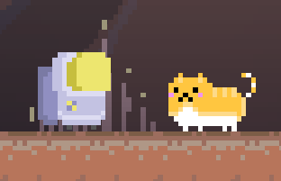
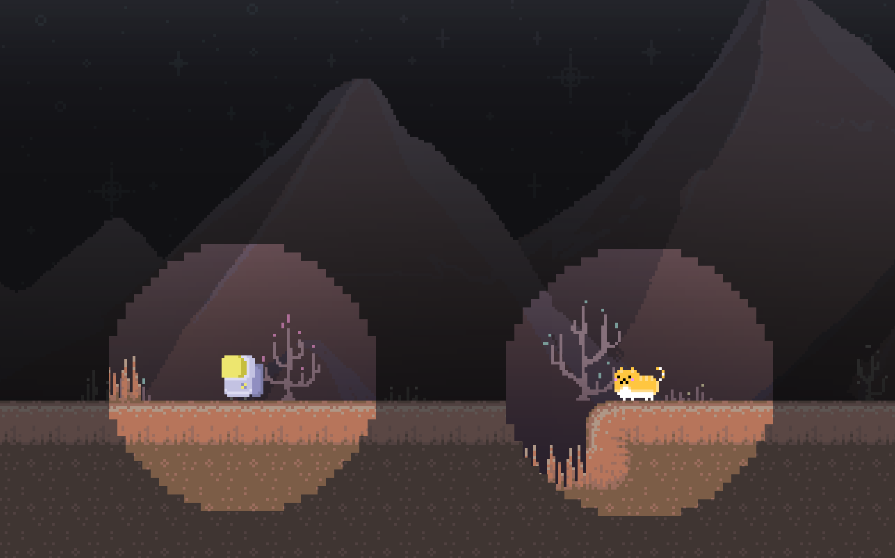

  
  

Homebound originally started as the final project for my ICS 111 class and I decide to remake of the game from scratch with a different approach but with the same message. The games’ main theme is to explore the meaning of a home. My goal is to convey this theme through purely through visual storytelling and game mechanics with no dialogue or words on screen. I want this game to be accessible as possible, to as wide of audience. Because the game and its story feature an absence of dialogue and text, players who don’t need to speak or understand English to grasp the games emotional message.

The players play as a lone astronaut who has been tasked to find a new home plant to inhabit. They land on a planet with previous inhabitants are nowhere to be found. The only sign of life is a single cat. The astronaut explores the planet with the cat to find the reason why all its inhabitants are missing. The player controls both the cat and the astronaut to solve puzzles. The astronaut can open doors, move heavy objects, and interact with machinery, while the cat can fit into smaller spaces, move faster, and jump higher. The player must use the unique aspects of both characters to get through the puzzles. 

Both characters have a bubble of "vision" which will slowly decrease over time but will return to normal size when they are both near each other. This "vision" is representative of feelings of comfort and home. Since the goal of game is to convey a meaningful non diegetic story the environment and game mechanics need to carry the emotional weight of story being presented. Through the game we see the astronaut and the cat relationship flourish as they must depend on each other to move on. Later the two get separated and the player must solve puzzles without the help of the other character. Like the characters in the story the player will struggle moving on alone. In the end they finally reunite truly discovering the meaning of home. 

