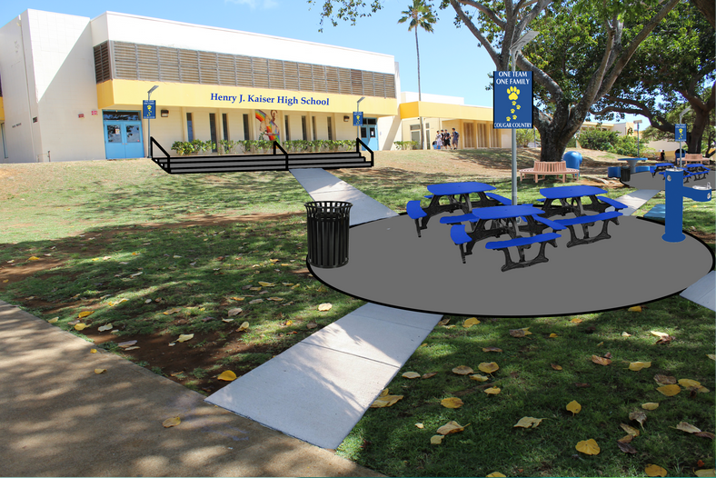

In my junior and senior years of high school I worked on project for creating a new location for students to gather. The goal was to create a place where students can 
gather, study, and relax in a central location on campus. Working within the student goverment class, we spoke to experts, professionals, and engineer's to get and idea
and cost of the scope of the project. My role as the technology coordinator lead me to create the design and look of the project. I created a visual representation
through photoshop. This visual was used when presenting the project to others. Our efforts lead us to presenting the project to our local representatives and senator.
Through our lobbying and with the help of our representatives and senators we were able to raise $400,000 for the project.

The project took about one year to complete from planning to the finished construction of the project. This is one of the projects I am proud of because I know that
future generations of students will be able to enjoy and benefit from even though they may not know who I am. It will have a long lasting impression on my community
and knowing that I had a direct hand in the process is priceless.

