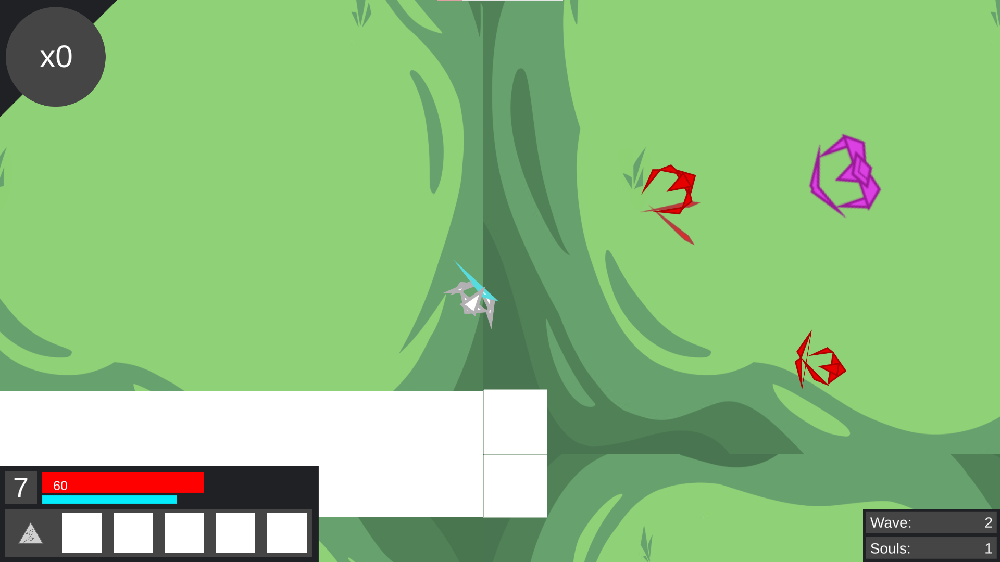

  

7DRL is short for 7 Day Roguelike, it is a game jam that runs yearly with the sole requirement for games submitted to the jam being that they must be roguelikes. Chronoblade is a top-down roguelike hack and slash created with the University of Manoa Game Dev club. For this project I headed the design of the game, created art assets, namely the player character, some of the enemies, and some of the UI elements and scored the game with original music. 

Roguelikes have a game play loop that often revolve around perma-death, randomization, and player upgrades. Chronoblade was broken up into 10 stages with each stage being harder than the last much like many roguelikes. The players objective would be to reach the 10th stage and kill the boss. Killing enemies would reward the player with a currency and experience points. With enough experience points the player would be able to level up and choose a perk that would increase their stats such has max health, damage, or armor. After every stage Players would be given a choice to ‘rewind time’ and return to the first stage or to move on to the next stage.  Choosing the rewind would grant the player access to a shop where they could spend their currency that they gained after killing enemies for powerful perks before returning to the first stage. With each subsequent rewind enemies would grow even stronger in power. After the 5th rewind they would immediately face the boss. Much like other roguelikes dying was permanent and ended the game.

The goal of this design was to force the player into a high risk and reward situation. A player would be able to maximize their experience and currency gains by completing as many stages as possible, which would allow the player to gain the most levels and buy the most upgrades when rewinding. But at the same time the player would risk ending their run early if they underestimated the difficulty of the next stage. To increase the stakes further there was also a ‘time pressure’. Each rewind would make enemies stronger and committing to all 5 rewinds would detrimental as it would exponentially multiply the boss’s health and damage, so a greedy approach to the game would not work.

The game was designed with three gameplay play loops in mind. First the player would kill enemies to gain currency and experience. Second the player would through a stage which presented waves of enemies. Lastly the player would ‘rewind’ and start the loop over again. These three loops were at the core of Chronoblades design

You can try the game out here: https://justiny.itch.io/chronoblade
